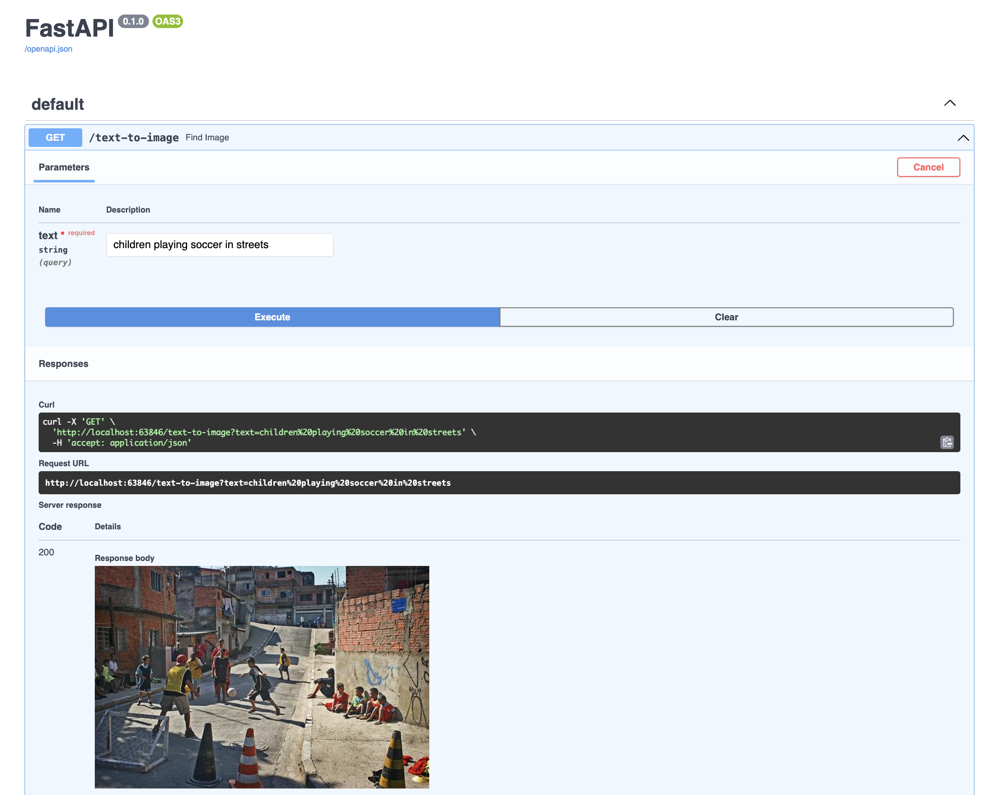
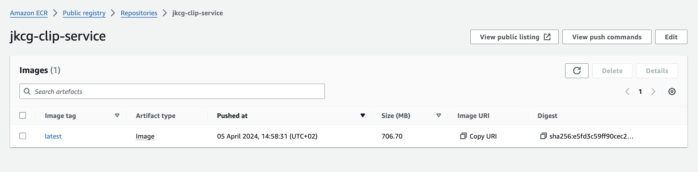
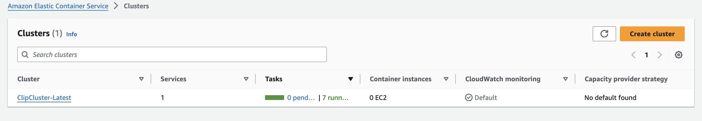
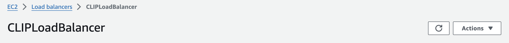
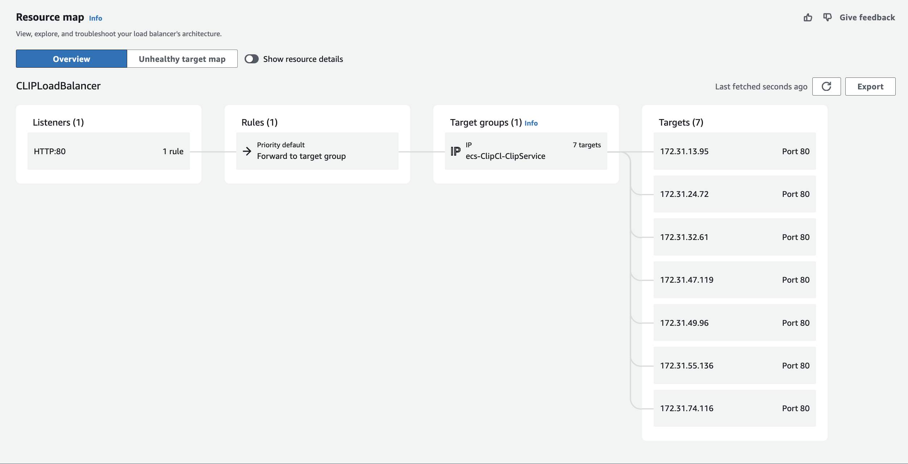
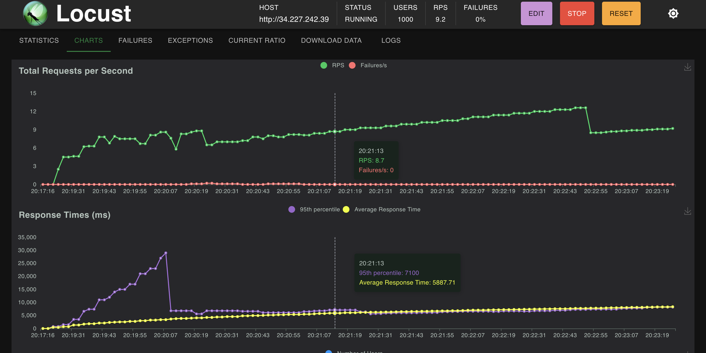

# model-deployment

## 1. Model Deployment on Browser

[ONNXRunTime - Web](https://onnxruntime.ai/docs/tutorials/web/)

## 2. Model Deployment with Fast API - AWS ECR, AWS ECS, AWS ApplicationLoadBalancer, Redis Cache

[Fast API](https://fastapi.tiangolo.com/)

